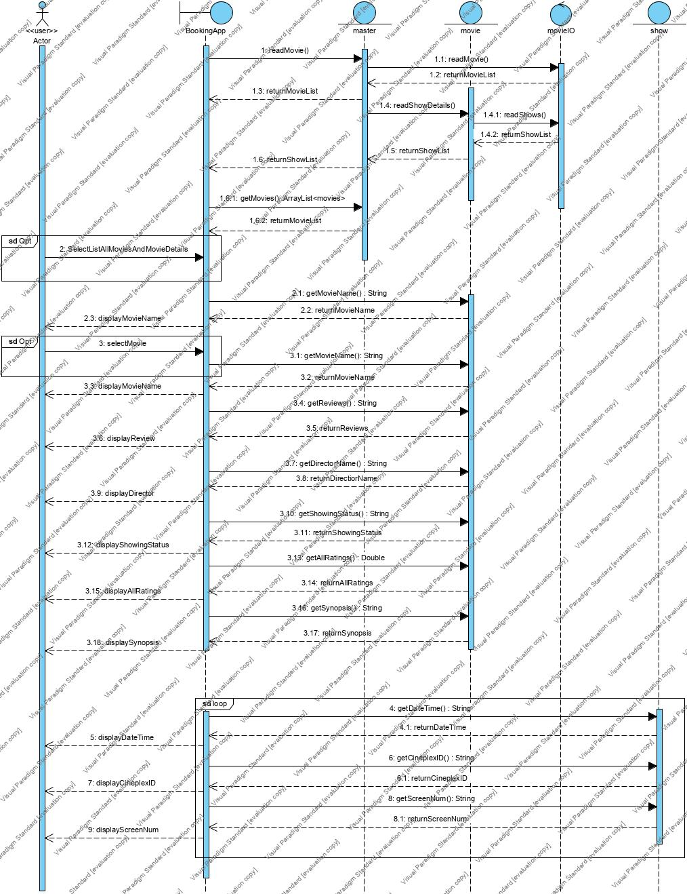

# Movie Booking and Listing Management Application (MOBLIMA)

MOBLIMA is an application to computerize the processes of making online bookings and purchasing of movie tickets, listing of movies and sales reporting. It may be used by both movie goers and cinema staff. 

> CZ2002 Object Oriented Programming and Design \
> School of Computer Science and Engineering \
> Nanyang Technological University

## UML Class Diagram

## UML Sequence Diagram

## Authors

* **Anusha Datta**
* **Jay Gupta**
* **Arumugam Ramaswamy**
* **Mehul Kumar**
* **Tianyi Wan**
